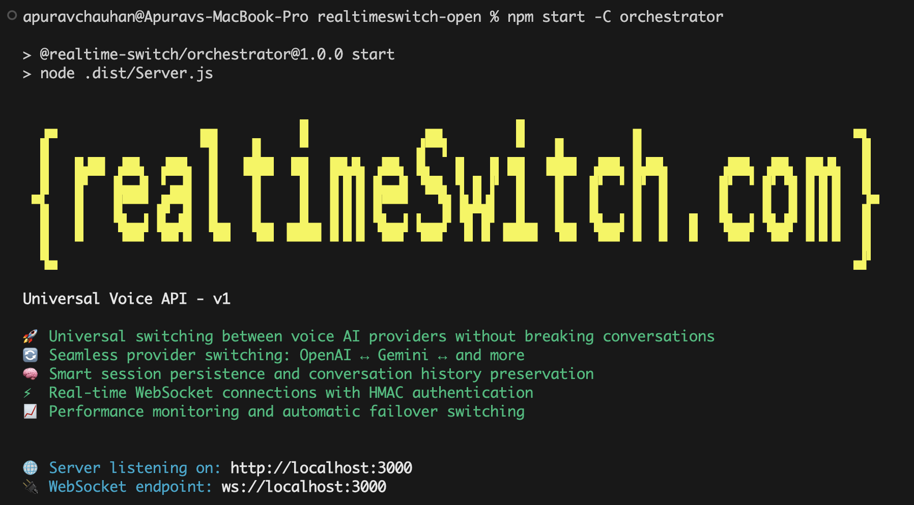

# [RealtimeSwitch.com](https://realtimeswitch.com) - Universal Voice API - v1



🚀 **Universal switching between voice AI providers without breaking conversations**  
🔄 **Seamless provider switching: OpenAI ↔ Gemini ↔ and more**  
🧠 **Smart session persistence and conversation history preservation**  
⚡ **Real-time WebSocket connections with HMAC authentication**  
📈 **Performance monitoring and automatic failover switching**

## Features

- **Native API Compatibility**: Out-of-the-box support for existing OpenAI Realtime API and Gemini Live API specifications - use any API style with our universal connection
- **Provider Agnostic**: Switch between OpenAI Realtime API, Gemini Live API, and future providers
- **Session Persistence**: Maintain conversation context across provider switches
- **Real-time WebSockets**: Low-latency bidirectional communication
- **Secure Authentication**: HMAC-based authentication with Firebase integration
- **Event Transformation**: Seamless translation between provider-specific event formats
- **Performance Monitoring**: Built-in metrics and automatic failover
- **Modular Architecture**: Plugin-based system for easy extensibility

## Architecture

### Connection Flow Overview

**Universal WebSocket API**: Users connect to RealtimeSwitch through a single WebSocket endpoint with powerful flexibility:

1. **API Style Selection**: Choose your preferred client API specification via `rs_api` parameter:
   - `OPENAI` - Use OpenAI Realtime API format for messages
   - `GEMINI` - Use Gemini Live API format for messages

2. **Provider Selection**: Specify which voice AI provider handles your requests via `rs_core` parameter:
   - `OPENAI` - Route to OpenAI's Realtime API
   - `GEMINI` - Route to Google's Gemini Live API

3. **Account-Based Authentication**: Secure connections using account credentials:
   - Each client has an `accountId` and `secretKey`
   - Generate HMAC-SHA256 token using your unique `sessionId`
   - Pass authentication via `rs_auth` parameter

4. **Session Persistence**: RealtimeSwitch preserves full context across:
   - **Provider switches** (OpenAI ↔ Gemini mid-conversation)
   - **Network interruptions** (automatic reconnection with state recovery)
   - **Connection drops** (resume conversations seamlessly)

**For Local Development**: Copy `.env.example` to `.env`, add your API keys, and start - no additional configuration needed!

### System Architecture

```
┌─────────────────┐    ┌──────────────────┐    ┌─────────────────┐
│   Client App    │◄──►│   Orchestrator   │◄──►│   Providers     │
│                 │    │                  │    │                 │
│ API Style:      │    │ • Authentication │    │ • OpenAI        │
│ • OpenAI Format │    │ • Session Mgmt   │    │ • Gemini        │
│ • Gemini Format │    │ • Event Transform│    │ • Future Provs  │
└─────────────────┘    └──────────────────┘    └─────────────────┘
                              │                        │
                              ▼                        ▼
                       ┌──────────────────┐    ┌─────────────────┐
                       │   Core System    │    │   Voice AI APIs │
                       │ • Event Pipeline │    │ • Real-time     │
                       │ • Checkpointing  │    │ • Streaming     │
                       │ • State Mgmt     │    │ • Function Call │
                       └──────────────────┘    └─────────────────┘
```

## Packages

- **`@realtime-switch/core`** - Core types and event management
- **`@realtime-switch/orchestrator`** - Main server and WebSocket handling
- **`@realtime-switch/providers-oai`** - OpenAI Realtime API integration
- **`@realtime-switch/providers-gemini`** - Gemini Live API integration
- **`@realtime-switch/transformers`** - Event format transformation
- **`@realtime-switch/extractors`** - Event extraction and parsing
- **`@realtime-switch/checkpoint`** - Session persistence and recovery
- **`@realtime-switch/switch`** - Provider switching logic
- **`@realtime-switch/accounts`** - Account management and authentication

## Quick Start

### Prerequisites
- **Node.js** v18+ and **npm** v8+
- **API Keys** from:
  - [OpenAI Platform](https://platform.openai.com/api-keys) (for OpenAI Realtime API)
  - [Google AI Studio](https://aistudio.google.com/app/apikey) (for Gemini Live API)

### 1. Install Dependencies
```bash
npm run install:all
```

### 2. Build All Packages
```bash
npm run build
```

### 3. Configure Environment
Create a `.env` file inside the `orchestrator` package:
```bash
cd orchestrator
cp .env.example .env
```

Edit `.env` and replace placeholder values with your actual API keys:
```bash
# Required: Add your API keys
OPENAI_API_KEY=sk-proj-your_actual_openai_key_here
GEMINI_API_KEY=your_actual_gemini_key_here

# Default test account (works as-is for local testing)
ACCOUNTS=996-sdassds-86-asd=secretkey-996
```

### 4. Start the Server
```bash
npm start
```

The server will be available at the configured HOST and PORT from your `.env` (default: `http://localhost:3000`)

### 5. Verify It Works
Test the connection using the web-based test client:
```bash
# In a new terminal (make sure RealtimeSwitch server is running first And
# you are in repo root before running below cmd)
cd orchestrator
npm run test:client
```

This will:
- Start a test web server (reads your `.env` configuration)
- Automatically open your browser to the test client
- Click Start and allow cam and mic permissions and start talking.
- Explore the index.html code inside orchestrator/test package to see realtime ws api usage

**Alternative CLI Test:**
```bash
node orchestrator/test/auth-test-client.js
```

You should see: `✅ WebSocket connected successfully!`

## Configuration Details

### Environment Variables
The `.env` file in the `orchestrator` package supports the following configuration:

```bash
# Server Configuration
PORT=3000
HOST=localhost

# Provider API Keys (Required)
OPENAI_API_KEY=your_openai_key_here     # Used when voice provider is set to OpenAI Realtime API
GEMINI_API_KEY=your_gemini_key_here     # Used when voice provider is set to Gemini Live API

# Account Authentication (for local development)
ACCOUNTS=your-account-id=your-secret-key   # Default HMAC key used for WebSocket authentication

# Database Configuration (Optional)
ENABLE_DB=false                            # Enable database for dynamic account management (default: false)
# Note: Local development doesn't need this, but enable if you want dynamic account management using a database

# Provider Switching Configuration
SWITCH_LATENCY_THRESHOLD_MS=500
SWITCH_FAILURE_COUNT=3
```

### API Keys Explained

- **OPENAI_API_KEY**: Used when a client connects with `rs_core=OPENAI` or when the system routes voice processing through OpenAI's Realtime API
- **GEMINI_API_KEY**: Used when a client connects with `rs_core=GEMINI` or when the system routes voice processing through Google's Gemini Live API

### HMAC Authentication System

**How WebSocket Authentication Works:**
1. **Account Setup**: Each account has an ID and secret key (stored in `ACCOUNTS` env var)
2. **Client-side**: Generate HMAC-SHA256 hash using: `HMAC(sessionId, secretKey)`
3. **Connection**: Include auth parameters in WebSocket URL query string
4. **Server-side**: Validates the HMAC signature before allowing connection

**ACCOUNTS Key (Local Development):**
- Format: `accountId=secretKey` (comma-separated for multiple accounts)
- Example: `ACCOUNTS=996-sdassds-86-asd=secretkey-996`
- Used for HMAC-SHA256 signature validation of WebSocket connections
- This default key setup allows quick local testing without database setup

**Required WebSocket URL Parameters:**
- `rs_accid`: Account ID (e.g., `996-sdassds-86-asd`)
- `rs_u_sessid`: Session ID (e.g., `session-123`)
- `rs_auth`: HMAC-SHA256 hash of sessionId using account's secret key
- `rs_api`: Client API format (`OPENAI` or `GEMINI`)
- `rs_core`: Provider to use (`OPENAI` or `GEMINI`)

**Step-by-Step HMAC Generation:**
```javascript
// Using the default account from .env
const crypto = require('crypto');
const accountId = '996-sdassds-86-asd';
const secretKey = 'secretkey-996';        // From ACCOUNTS env var
const sessionId = 'test-session-browser'; // Your session identifier

// Generate HMAC-SHA256 signature
const authHash = crypto.createHmac('sha256', secretKey).update(sessionId).digest('hex');
// Result: '905b80fa2656d8f34c00e077260fc8972502591c384c9413228dbcb19dc7e041'

// Connect with all required parameters
const ws = new WebSocket(`ws://localhost:3000?rs_accid=${accountId}&rs_u_sessid=${sessionId}&rs_auth=${authHash}&rs_api=OPENAI&rs_core=GEMINI`);
```

**Test HMAC Generation:**
For testing and validation, use the included test clients:
```bash
# Web-based test client (recommended)
cd orchestrator && npm run test:client

# Or Node.js CLI test client
node orchestrator/test/auth-test-client.js
```
These generate the correct HMAC hash (`905b80fa2656d8f34c00e077260fc8972502591c384c9413228dbcb19dc7e041`) and test the connection with the default account.

### Database Integration (Optional)

**ENABLE_DB Configuration:**
- **`ENABLE_DB=false` (Default)**: Uses only `ACCOUNTS` from .env for authentication - perfect for local development and testing
- **`ENABLE_DB=true`**: Enables database integration for dynamic account management - ideal for production environments

**When ENABLE_DB=true:**

**Firestore Integration:**
- Provides dynamic account creation and management
- Stores account keys securely with Firebase authentication integration  
- Requires `FIRESTORE_PROJECT_ID` and `GOOGLE_APPLICATION_CREDENTIALS` in your .env

**Extensible Architecture:**
- The `AccountManager` interface can be extended for any database
- Implement your own: `RedisAccountManager`, `PostgreSQLAccountManager`, etc.
- Simply swap the implementation in `Server.ts`:
  ```typescript
  const accountManager = new YourCustomAccountManager();
  ```

**Authentication Fallback System:**
1. **First**: Checks `ACCOUNTS` from .env configuration
2. **Then**: Falls back to database lookup (if `ENABLE_DB=true`)
3. **Result**: `.env` accounts work immediately, database provides additional accounts when needed

## Usage Examples

### WebSocket Connection

```javascript
// Using the default account from .env.example
const ws = new WebSocket('ws://localhost:3000?rs_accid=996-sdassds-86-asd&rs_u_sessid=test-session-browser&rs_auth=905b80fa2656d8f34c00e077260fc8972502591c384c9413228dbcb19dc7e041&rs_api=OPENAI&rs_core=GEMINI');
```

### Complete Client Example

⚠️ **Security Warning**: The example below shows HMAC generation for demonstration purposes only. In production, **never expose secret keys in client-side code or public assets**. Your backend server should generate the HMAC hash and provide it to the client, similar to how ephemeral keys or JWT tokens are handled.

```javascript
// ⚠️ SECURITY NOTICE: This is for local testing only
// In production, your server generates the authHash and sends it to the client
const crypto = require('crypto');
const accountId = '996-sdassds-86-asd';
const sessionId = 'test-session-browser';
const secretKey = 'secretkey-996';  // ⚠️ NEVER expose this in client code

const authHash = crypto.createHmac('sha256', secretKey).update(sessionId).digest('hex');
// authHash will be: '905b80fa2656d8f34c00e077260fc8972502591c384c9413228dbcb19dc7e041'

// Connect to RealtimeSwitch with OpenAI API style and Gemini provider
const ws = new WebSocket(`ws://localhost:3000?rs_accid=${accountId}&rs_u_sessid=${sessionId}&rs_auth=${authHash}&rs_api=OPENAI&rs_core=GEMINI`);

ws.on('open', () => {
    console.log('Connected to RealtimeSwitch');
    // Send voice events in OpenAI format - they'll be transformed to Gemini automatically
});

ws.on('message', (data) => {
    // Receive responses in OpenAI format - transformed from Gemini responses
    console.log('Received:', JSON.parse(data.toString()));
});
```

**Production Implementation:**
```javascript
// Secure client implementation - get authHash from your backend
const accountId = 'your-account-id';
const sessionId = 'unique-session-id';

// Call your backend API to get the HMAC hash
const response = await fetch('/api/auth/websocket-token', {
    method: 'POST',
    headers: { 'Content-Type': 'application/json' },
    body: JSON.stringify({ accountId, sessionId })
});
const { authHash } = await response.json();

// Use the server-generated hash to connect
const ws = new WebSocket(`ws://localhost:3000?rs_accid=${accountId}&rs_u_sessid=${sessionId}&rs_auth=${authHash}&rs_api=OPENAI&rs_core=GEMINI`);
```

## Client API Examples

### Example 1: Gemini API Style with Gemini Provider

Use native Gemini Live API format for both sending and receiving messages:

```javascript
// Connect with Gemini API style and Gemini provider
const ws = new WebSocket(`ws://localhost:3000?rs_accid=${accountId}&rs_u_sessid=${sessionId}&rs_auth=${authHash}&rs_api=GEMINI&rs_core=GEMINI`);

ws.on('open', () => {
    // Start session using Gemini Live API format
    ws.send(JSON.stringify({
        setup: {
            model: "models/gemini-2.0-flash-exp",
            generation_config: {
                response_modalities: ["AUDIO"],
                speech_config: {
                    voice_config: { prebuilt_voice_config: { voice_name: "Aoede" } }
                }
            }
        }
    }));
});

// Send audio using Gemini format
const sendAudio = (audioData) => {
    ws.send(JSON.stringify({
        realtime_input: {
            media_chunks: [{
                mime_type: "audio/pcm",
                data: audioData // Base64 encoded audio
            }]
        }
    }));
};

// Receive responses in Gemini format
ws.on('message', (data) => {
    const response = JSON.parse(data.toString());
    if (response.serverContent?.modelTurn?.parts) {
        console.log('Gemini response:', response.serverContent.modelTurn.parts);
    }
    if (response.serverContent?.outputTranscription) {
        console.log('Gemini transcription:', response.serverContent.outputTranscription.text);
    }
});
```

### Example 2: OpenAI API Style with OpenAI Provider

Use native OpenAI Realtime API format for both sending and receiving messages:

```javascript
// Connect with OpenAI API style and OpenAI provider
const ws = new WebSocket(`ws://localhost:3000?rs_accid=${accountId}&rs_u_sessid=${sessionId}&rs_auth=${authHash}&rs_api=OPENAI&rs_core=OPENAI`);

ws.on('open', () => {
    // Configure session using OpenAI Realtime API format
    ws.send(JSON.stringify({
        type: 'session.update',
        session: {
            modalities: ['text', 'audio'],
            voice: 'alloy',
            input_audio_format: 'pcm16',
            output_audio_format: 'pcm16',
            turn_detection: { type: 'server_vad' }
        }
    }));
});

// Send audio using OpenAI format
const sendAudio = (audioData) => {
    ws.send(JSON.stringify({
        type: 'input_audio_buffer.append',
        audio: audioData // Base64 encoded PCM16 audio
    }));
};

// Receive responses in OpenAI format
ws.on('message', (data) => {
    const event = JSON.parse(data.toString());
    
    // Handle different OpenAI event types
    switch (event.type) {
        case 'session.created':
        case 'session.updated':
            console.log('Session:', event.session);
            break;
        case 'response.audio.delta':
            console.log('Audio chunk:', event.delta);
            break;
        case 'response.audio_transcript.delta':
            console.log('Transcript:', event.delta);
            break;
        case 'conversation.item.input_audio_transcription.completed':
            console.log('Input transcribed:', event.transcript);
            break;
        case 'response.function_call_arguments.delta':
            console.log('Function args:', event.delta);
            break;
        case 'response.done':
            console.log('Response completed:', event.response.status);
            break;
        case 'input_audio_buffer.speech_started':
            console.log('Speech started');
            break;
        case 'input_audio_buffer.speech_stopped':
            console.log('Speech stopped');
            break;
    }
});
```

### Example 3: Mixed API Styles (Cross-Provider Compatibility)

Use OpenAI API format with Gemini provider backend - RealtimeSwitch handles the translation:

```javascript
// Connect with OpenAI API style but Gemini provider backend
const ws = new WebSocket(`ws://localhost:3000?rs_accid=${accountId}&rs_u_sessid=${sessionId}&rs_auth=${authHash}&rs_api=OPENAI&rs_core=GEMINI`);

ws.on('open', () => {
    // Send OpenAI format - will be translated to Gemini internally
    ws.send(JSON.stringify({
        type: 'session.update',
        session: {
            modalities: ['text', 'audio'],
            voice: 'alloy', // Mapped to Gemini voice
            input_audio_format: 'pcm16',
            output_audio_format: 'pcm16'
        }
    }));
});

// Send in OpenAI format, processed by Gemini
const sendAudio = (audioData) => {
    ws.send(JSON.stringify({
        type: 'input_audio_buffer.append',
        audio: audioData
    }));
};

// Receive OpenAI format responses (translated from Gemini)
ws.on('message', (data) => {
    const event = JSON.parse(data.toString());
    // Responses come back in OpenAI format even though Gemini processes them
    if (event.type === 'response.audio.delta') {
        console.log('Translated audio from Gemini:', event.delta);
    }
    if (event.type === 'response.audio_transcript.delta') {
        console.log('Translated transcript from Gemini:', event.delta);
    }
});
```

**For Development (with hot reload):**
```bash
npm run dev
```


## API Documentation

We are looking for early adopters and developers who can help us test this API. If interested, please join our early adopters program at [realtimeswitch.com](https://realtimeswitch.com).

[Documentation](https://realtimeswitch.com/docs/introduction)

## License

MIT License - see [LICENSE](LICENSE) for details.

## Authors

- **Apurav Chauhan** 
- **Indu Chauhan**

---
